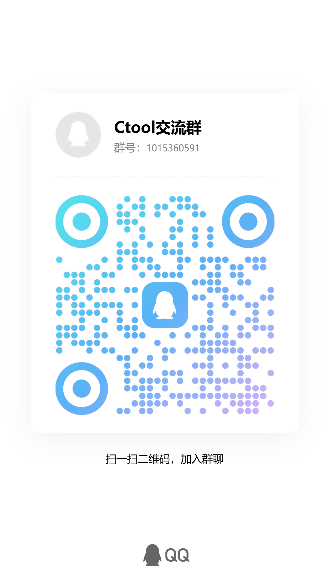

<p align="center">
  
</p>

<h1 align="center">CTool</h1>

<p align="center">
  面向 RPG Maker MV / MZ 游戏的 Windows 桌面辅助工具
</p>

CTool 可以识别并启动本地 RPG Maker MV / MZ 游戏，通过临时注入本地插件读取和修改运行时数据，并提供文本提取、翻译加载、数据内嵌与 AI 批量翻译功能。

> [!WARNING]
> CTool 仍在开发中，注入和内嵌翻译会修改目标游戏文件。使用前请完整备份游戏目录与存档，并只从官方仓库获取代码。不要在无法承受数据损失的游戏副本上直接测试。

## 主要功能

- 自动识别 RPG Maker MV / MZ 及其版本
- 修改金币、移动速度、遇敌、整队、穿墙等运行时状态
- 添加道具、防具和武器，修改变量、开关与角色数据
- 在战斗中触发胜利、失败等操作，并支持全局快捷键
- 提取游戏文本，实时加载翻译 JSON
- 备份、内嵌和还原游戏数据翻译
- 使用自备 OpenAI 或 DeepSeek API Key 批量翻译，支持断点续传
- 保存游玩历史，快速重新启动游戏或打开游戏目录

功能是否生效取决于游戏版本、插件和定制程度。

## 兼容性

| 项目 | 支持情况 |
| --- | --- |
| Windows | 支持 |
| RPG Maker MV | 支持 |
| RPG Maker MZ | 支持 |
| Wolf RPG Editor | 暂不支持 |
| 其他平台与引擎 | 暂不支持 |

经过加密、特殊封装或大幅修改目录结构的游戏，可能无法识别或注入。

## 从源码运行

需要 Node.js 22 和 npm 10。

```powershell
git clone https://github.com/ansmycode/CTool.git
cd CTool
npm install
npm run dev
```

启动后：

1. 备份游戏目录和存档。
2. 在“游戏启动”页选择游戏的 `Game.exe`。
3. 确认识别结果为 MV 或 MZ，点击“启动游戏并注入脚本”。
4. 等待游戏完成加载，再使用 CTool 修改数据。

CTool 与游戏使用本机 `5000`、`5001` 端口通信。连接失败时，请检查端口占用和防火墙设置；部分游戏需要进入地图后才会完成连接。

## 翻译文件

翻译文件是“原文 -> 译文”的 JSON 对象：

```json
{
  "New Game": "新游戏",
  "Continue": "继续游戏"
}
```

实时加载只影响当前运行；内嵌翻译会直接修改游戏数据。CTool 会在游戏目录的 `CTool_Backups` 中创建备份，但仍建议先自行复制完整游戏目录。

AI 翻译使用用户提供的 API Key。Key 只在本次运行期间使用，不会写入配置或工作文件；翻译结果仍需人工检查。

## 开发

| 命令 | 用途 |
| --- | --- |
| `npm run dev` | 启动 Vite 与 Electron |
| `npm run build` | 类型检查并构建前端 |
| `npm run lint` | 运行 ESLint |
| `npm run test:ai` | 测试 AI 翻译流程 |
| `npm run test:backup` | 测试备份与还原 |
| `npm run test:injection` | 测试 MV/MZ 插件注入 |
| `npm run dist` | 构建 Windows 分发包 |

开发者和 AI 编码工具请先阅读 [AGENTS.md](./AGENTS.md)，其中包含当前架构、模块边界、任务定位和修改约束。专项设计与规划位于 [`docs/`](./docs/)。

## 联系方式/反馈

欢迎加入 CTool 项目交流群，交流使用心得或反馈问题。

**QQ 群：1015360591**

<p align="center">
  
</p>

欢迎通过 [GitHub Issues](https://github.com/ansmycode/CTool/issues) 报告问题或提出建议，也欢迎提交 Pull Request。报告问题时请附上 CTool 版本、Windows 版本、游戏引擎与版本、复现步骤和错误截图；请勿上传游戏本体、存档或其他受版权保护的内容。

## 许可与免责声明

CTool 采用 [PolyForm Noncommercial License 1.0.0](./LICENSE)，允许个人及其他非商业用途下使用、研究、修改和再分发；任何商业用途均须事先获得作者的书面授权。因此，本项目属于“源码可用（source-available）”，并非 OSI 定义的开源软件。

使用者应遵守游戏许可协议及当地法律，不得将本工具用于破坏他人数据、绕过付费机制、网络游戏作弊或其他违法违规活动，并自行承担使用过程中造成的数据损失。第三方修改、重新打包或分发版本不受本项目控制。

## 鸣谢

感谢 Justype 作者及其项目 [RPGMakerUtils](https://github.com/Justype/RPGMakerUtils)，为 RPG Maker 翻译功能提供了重要思路与参考。
