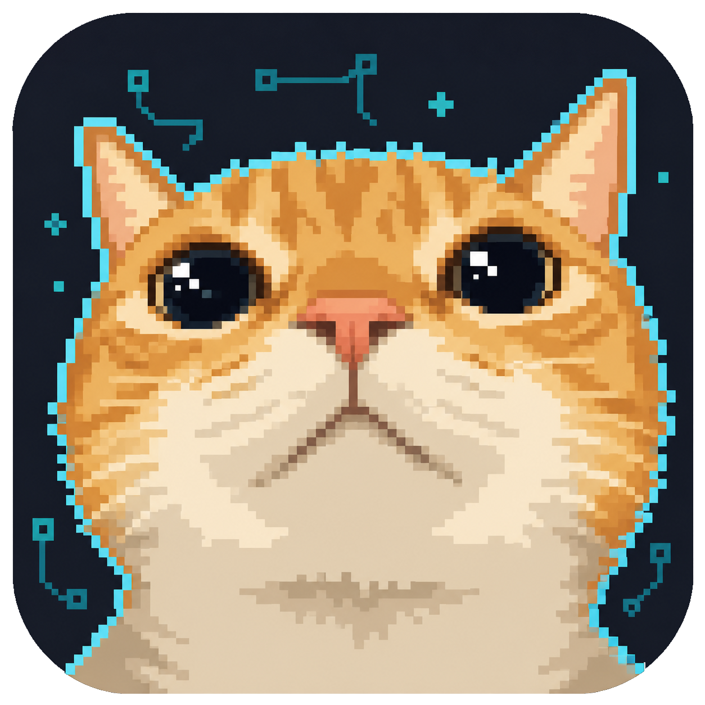

<p align="center">
  
</p>

<h1 align="center">CTool</h1>

<p align="center">
  面向 RPG Maker MV / MZ 游戏的 Windows 桌面辅助工具
</p>

CTool 可以识别本地游戏的引擎与版本，在启动游戏时注入本地脚本，并提供运行时数据修改、文本提取与翻译加载等功能。项目使用 Electron、React、TypeScript 和 Vite 构建。

> [!WARNING]
> 项目仍在开发中。CTool 会向游戏目录复制脚本并修改 `index.html`；部分修改也可能影响存档。使用前请完整备份游戏目录和存档，不要在无法承受数据损失的游戏副本上直接测试。

## 功能

- 自动识别 RPG Maker MV / MZ 游戏及其引擎版本
- 启动游戏并与运行中的游戏建立本地通信
- 修改金币、移动速度、遇敌、整队与穿墙状态
- 添加道具、防具和武器
- 查看并修改游戏变量与开关
- 调整角色队伍、职业、等级、经验和战斗属性
- 在战斗中直接取得胜利
- 加载实时翻译文件、提取游戏文本、将翻译写入游戏数据
- 使用自备 OpenAI 或 DeepSeek API Key 批量翻译提取后的 JSON，并支持断点续传
- 保存游玩历史，并可从历史记录再次启动或打开游戏目录

具体功能是否生效取决于游戏版本、插件和脚本定制情况。

## 兼容性

| 项目 | 当前支持情况 |
| --- | --- |
| 操作系统 | Windows |
| RPG Maker MV | 支持 |
| RPG Maker MZ | 支持 |
| Wolf RPG Editor | 暂不支持，处于计划阶段 |
| 其他 RPG 引擎 | 暂不支持 |

CTool 当前通过选择 `Game.exe` 启动游戏，并在游戏目录三层以内查找 `rpg_core.js` / `rmmz_core.js`、`System.json` 和 `index.html`。经过特殊封装、加密或大幅修改目录结构的游戏可能无法识别或注入。

## 使用方法

目前仓库未提供正式 Release，建议先从源码运行：

```powershell
git clone https://github.com/ansmycode/CTool.git
cd CTool
npm install
npm run dev
```

本项目当前在 Node.js 22 与 npm 10 环境下开发。启动后：

1. 先备份游戏目录及存档。
2. 在“游戏启动”页面选择游戏的 `Game.exe`。
3. 确认识别出的引擎为 MV 或 MZ，然后点击“启动游戏并注入脚本”。
4. 等待游戏初始化完成，再在 CTool 中修改数据。
5. 修改后回到游戏确认结果，并在适当时机正常存档。

工具与游戏通过本机的 `5000`、`5001` 端口通信。如果界面一直停留在加载状态，请检查端口是否被其他程序占用，以及防火墙是否拦截了本地连接。

## 翻译文件

翻译文件是一个 JSON 对象：键为游戏原文，值为替换后的文本。

```json
{
  "New Game": "新游戏",
  "Continue": "继续游戏"
}
```

- **加载翻译文件**：将 JSON 发送给当前运行中的游戏，适合临时预览。
- **提取文本**：扫描游戏数据并在游戏目录生成 `CatToolTranslate.json`。当前不会完整提取插件脚本中的文本。
- **自动内嵌文本**：先在游戏目录创建带时间戳的 `data_backup_*.zip`，再直接替换 `data` 目录中的 JSON 内容。该功能仍不稳定，请只在备份副本上使用。

### AI 批量翻译

启动游戏并进入“翻译”页面后，可以选择 CTool 提取的纯净 JSON，配置 OpenAI 或 DeepSeek 的 API 地址、API Key、模型和语言，再进行连接测试与批量翻译。

- API Key 仅在本次运行期间使用，不写入配置文件或工作文件。
- 翻译内容会自动分批请求，每批完成后立即保存进度。
- 首次开始翻译时会在原始 JSON 同目录生成 `*.ctool-ai-work.json` 工作文件。
- 工具意外关闭后，重新选择同一个原始 JSON 即可继续未完成任务。
- 全部完成后生成 `*.ai-translated.json` 纯净译文；第一版不会自动删除工作文件。
- 当前开放 OpenAI 和 DeepSeek，Kimi 与自定义兼容接口暂未接入。

AI 输出具有不确定性，最终译文和游戏内效果需要人工检查。详细设计与已完成范围见 [AI 翻译功能计划书](./docs/AI_TRANSLATION_PLAN.md)。

## 开发

| 命令 | 用途 |
| --- | --- |
| `npm run dev` | 并行启动 Vite 与 Electron，推荐用于完整功能调试 |
| `npm run dev:react` | 仅启动 Vite 前端；依赖 Electron API 的功能不可用 |
| `npm run dev:electron` | 仅启动 Electron；要求 Vite 开发服务器已经运行 |
| `npm run build` | 执行 TypeScript 检查并构建前端 |
| `npm run test:ai` | 运行 AI 翻译工作文件、分批和接口模拟测试 |
| `npm run lint` | 运行 ESLint |
| `npm run dist` | 构建 Windows 分发产物 |

核心目录：

```text
src/
├─ electron/              Electron 主进程、窗口、IPC 与业务服务
│  ├─ ipc/                渲染进程调用入口
│  ├─ services/           检测、注入、翻译和历史记录服务
│  ├─ ai/                 AI 服务请求、分批、重试与断点工作文件
│  └─ window/             BrowserWindow 创建与开发/生产加载策略
├─ engine/mvmz/           MV/MZ 游戏文件处理、注入和文本提取逻辑
├─ game/                  渲染进程的统一游戏数据层
│  ├─ adapters/mvmz.ts    MV/MZ 通信、原始字段转换与能力声明
│  ├─ registry.ts         游戏引擎与 Adapter 的注册关系
│  ├─ types.ts            CTool 统一游戏数据和能力类型
│  └─ useGameData.ts      React 游戏状态、操作分发与刷新
├─ lib/http.ts            与具体引擎无关的 HTTP 请求工具
├─ components/            可复用的 React 公共组件
├─ ui/                    页面与功能界面
│  └─ CheatMenu/          能力驱动的修改菜单与懒加载 Tab 注册表
└─ utils/                 引擎检测、历史记录与文件工具
inject/                   注入游戏的修改与翻译脚本
docs/                     架构与功能计划文档
```

架构分为两条主要链路。

Electron 负责选择游戏、检测引擎、修改游戏文件并启动游戏：

```text
选择 Game.exe
  → 识别 MV/MZ 与版本
  → 备份并修改游戏 index.html
  → 复制并加载 inject/*.js
  → 启动游戏
  → CTool 通过 localhost 与游戏交换数据
```

进入 CheatMenu 后，React 页面不直接兼容各引擎的原始字段，而是使用统一数据层：

```text
CheatMenu
  → useGameData 管理状态并在修改后刷新
  → registry 根据引擎选择 Adapter
  → Adapter 调用游戏 API 并转换原始字段
  → http.ts 与游戏中的注入服务通信
```

例如 MV/MZ 返回的 `allItem`、`allMembers` 会在 Adapter 中转换为统一的 `items`、`actors`。CheatMenu 只使用统一字段和能力集合，不需要判断当前具体是哪一种引擎。不同引擎不支持的页面，可由 Adapter 声明的能力决定是否显示；各个 CheatMenu Tab 也会在第一次访问时按需加载。

## 已知问题与风险

- 文本提取尚未适配插件脚本中的全部文本。
- 自动内嵌翻译的兼容性和稳定性仍需完善。
- 插件较多或深度定制过的 MV/MZ 游戏可能出现识别、注入或数据修改失败。
- 当前版本退出游戏时不会自动还原已修改的 `index.html`，且会删除注入时生成的 `index.html.bak`。请务必自行保留完整备份。
- 工具异常退出时，游戏目录可能保留 `cheat.js`、`translator.js` 或注入标记。

如果遇到问题，提交 Issue 时请附上：CTool 版本、操作系统、游戏引擎与版本、复现步骤和错误截图。请勿上传游戏本体、存档或其他受版权保护的内容。

## 计划

- 提高文本提取与内嵌翻译的完整性和稳定性
- 增加仅开发环境可用的页面快速预览入口（详见 [开发页面预览计划](./docs/DEV_PAGE_PREVIEW_PLAN.md)）
- 适配更多旧版 RPG Maker 引擎
- 研究 Wolf RPG Editor 支持
- 持续修复兼容性问题并改善使用体验

## 反馈与贡献

欢迎通过 [GitHub Issues](https://github.com/ansmycode/CTool/issues) 报告问题或提出建议，也欢迎提交 Pull Request。涉及新功能时，建议先在 Issue 中说明使用场景和预期行为，便于确认实现方向。

## 免责声明

本项目仅对作者在官方仓库及官方指定渠道发布的版本负责。第三方 Fork、修改、重新打包、镜像或分发的版本不属于官方版本，其内容、行为与安全性不受作者控制。对于用户从非官方渠道取得或运行的版本，作者在适用法律允许的最大范围内不提供任何保证，也不承担由第三方修改、分发或使用所造成的责任。  
本项目仅授权非商业使用。任何直接或间接以营利、收费、广告变现、付费服务、商业推广或获取商业利益为目的的使用，均须事先取得作者书面商业授权。
本工具仅供学习、研究和个人用途。请遵守游戏许可协议及当地法律，不得将其用于破坏他人数据、绕过付费机制、网络游戏作弊或其他违法用途。因使用本工具造成的游戏文件、存档或其他数据损失，由使用者自行承担。
