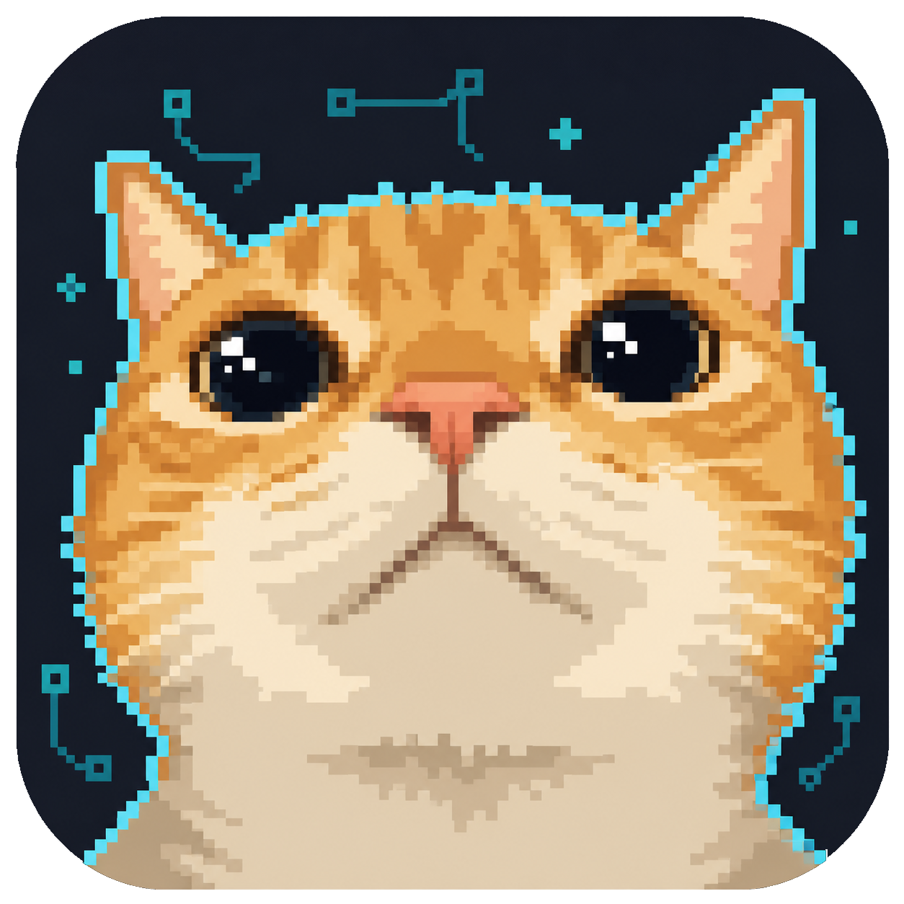
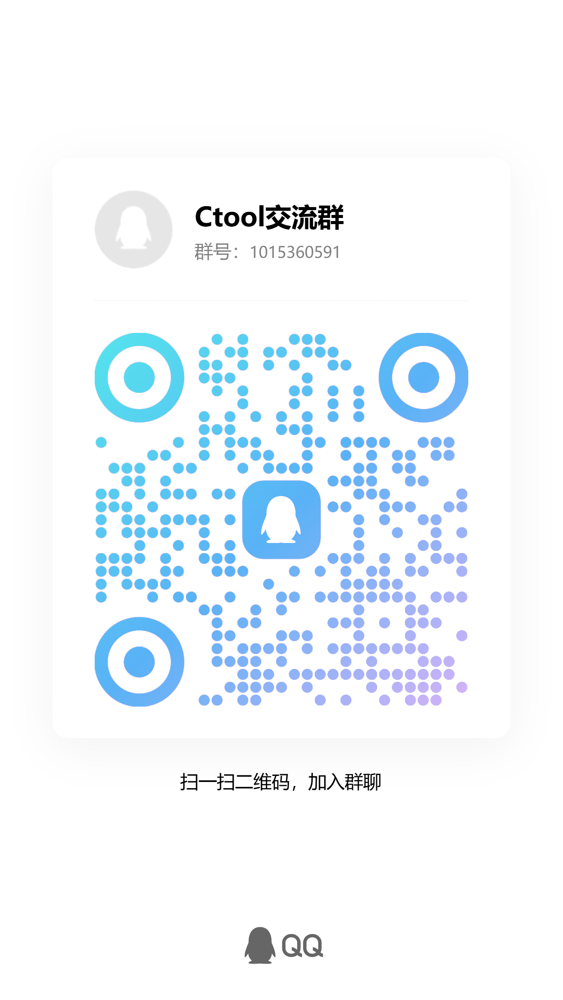

<p align="center">
  
</p>

<h1 align="center">CTool</h1>

<p align="center">
  面向 RPG Maker MV / MZ 与 Wolf RPG Editor 游戏的 Windows 桌面辅助工具
</p>

CTool 可以识别并启动本地 RPG Maker MV / MZ 与普通 Wolf x86 游戏。MV/MZ 使用临时插件，Wolf 使用原生 DLL 读取和修改运行时数据；不同引擎的功能范围见下表。

> [!WARNING]
> CTool 仍在开发中，注入和内嵌翻译会修改目标游戏文件。使用前请完整备份游戏目录与存档，并只从官方仓库获取代码。不要在无法承受数据损失的游戏副本上直接测试。

## 主要功能

- 识别并启动支持的游戏，保存游玩历史，快速打开游戏目录
- 启动前选择原游戏字体或内置 Noto Sans CJK SC
- 按引擎提供运行时修改、文本提取与译文加载
- 使用 OpenAI、DeepSeek、Claude、Kimi、通义千问或 Z.AI 批量翻译，支持自定义兼容接口、本地模型与断点续传

| 功能 | RPG Maker MV / MZ | 普通 Wolf x86 |
| --- | --- | --- |
| 运行时修改 | 金币、移动速度、遇敌、整队、穿墙；物品、角色、变量、开关；战斗操作 | 金币、已存在库存数量、数值变量、0.25–4 倍变速、穿墙 |
| 全局快捷键 | 已接入支持的动作 | 当前支持切换穿墙 |
| 文本提取与 AI 翻译 | 支持 | 支持已有独立 MPS/DAT 数据文件的提取与通用 AI 翻译 |
| 运行时译文加载 | 支持 | 已接入，基础翻译仍有技术问题，真实显示效果待验收 |
| 数据内嵌、备份还原 | 支持 | 暂不支持 |

功能是否生效取决于游戏版本、插件和定制程度。

## 兼容性

| 项目 | 支持情况 |
| --- | --- |
| Windows | 支持 |
| RPG Maker MV | 支持 |
| RPG Maker MZ | 支持 |
| Wolf RPG Editor | 部分支持普通 x86 游戏；暂不支持 x64 与 Pro |
| 其他平台与引擎 | 暂不支持 |

经过加密、特殊封装或大幅修改目录结构的游戏，可能无法识别或注入。

Wolf 的金币、数值变量、变速和穿墙已在用户测试游戏中确认，不代表所有版本兼容。库存仅允许修改映射明确且已存在的数量记录，不创建缺失记录；尚无角色修改。文本提取不提供资源包解包，数据库文件需配套同名 `.project`；字体替换不解决文字编码、图片文字或固定文本框的兼容问题。

## 从源码运行

需要 Node.js 22 和 npm 10。以下命令获取当前包含 Wolf 适配的 `wolf` 分支。

```powershell
git clone --branch wolf https://github.com/ansmycode/CTool.git
cd CTool
npm install
npm run dev
```

从源码使用 Wolf 运行时功能前，还需安装 Visual Studio C++ x86 构建工具与 CMake，并在仓库根目录运行 `npm run build:native`。DLL 与 injector 必须成对更新，详情见 [原生组件说明](./native/README.md)。Wolf 文本解析器本身不依赖原生组件。

启动后：

1. 备份游戏目录和存档。
2. 在“游戏启动”页选择游戏的 `Game.exe`。
3. 确认识别结果受支持，可选择启动字体，点击“启动游戏并连接”。
4. 等待游戏完成加载，再使用 CTool 修改数据。

MV/MZ 与工具通过本机 `5000`、`5001` 端口通信；Wolf 通过 injector 与 DLL 的本机 Named Pipe 通信。MV/MZ 连接失败时可检查端口占用和防火墙设置；部分游戏需要进入地图后才会完成连接。Wolf 修改数据时应避开读档或切场景过程。

## 翻译文件

翻译文件是“原文 -> 译文”的 JSON 对象：

```json
{
  "New Game": "新游戏",
  "Continue": "继续游戏"
}
```

MV/MZ 实时译文只影响当前运行；内嵌翻译会直接修改游戏数据，并在游戏目录的 `CTool_Backups` 中创建备份，仍建议先自行复制完整游戏目录。

Wolf 译文加载后会在该游戏目录保存独立副本，后续启动尝试自动恢复；成功卸载后取消恢复。译文 JSON 的原文和译文都不能保留控制符。Wolf 运行时翻译尚未完善，不能视作完整兼容；暂不支持文件内嵌及其备份还原。

AI 翻译使用用户提供的 API Key。Key 只在本次运行期间使用，不会写入配置或工作文件；翻译结果仍需人工检查。

## 开发

| 命令 | 用途 |
| --- | --- |
| `npm run dev` | 启动 Vite 与 Electron |
| `npm run build` | 类型检查并构建前端 |
| `npm run lint` | 运行 ESLint |
| `npm run test:ai` | 测试 AI 翻译流程 |
| `npm run test:backup` | 测试备份与还原 |
| `npm run test:injection` | 测试 MV/MZ 插件注入 |
| `npm run build:native` | 构建 Wolf x86 原生组件 |
| `npm run test:wolf` | 测试 Wolf 适配、协议与文本处理 |
| `npm run test:native:unit` | 运行原生单元测试 |
| `npm run dist` | 构建 Windows 分发包 |

开发者和 AI 编码工具请先阅读 [AGENTS.md](./AGENTS.md)，其中包含当前架构、模块边界、任务定位和修改约束。本地专项文档按该文件导航；`docs/` 不随新克隆分发。

## 联系方式/反馈

欢迎加入 CTool 项目交流群，交流使用心得或反馈问题。

**QQ 群：1015360591**

<p align="center">
  
</p>

欢迎通过 [GitHub Issues](https://github.com/ansmycode/CTool/issues) 报告问题或提出建议，也欢迎提交 Pull Request。报告问题时请附上 CTool 版本、Windows 版本、游戏引擎与版本、复现步骤和错误截图；请勿上传游戏本体、存档或其他受版权保护的内容。

## 许可与免责声明

CTool 采用 [PolyForm Noncommercial License 1.0.0](./LICENSE)，允许个人及其他非商业用途下使用、研究、修改和再分发；任何商业用途均须事先获得作者的书面授权。因此，本项目属于“源码可用（source-available）”，并非 OSI 定义的开源软件。

使用者应遵守游戏许可协议及当地法律，不得将本工具用于破坏他人数据、绕过付费机制、网络游戏作弊或其他违法违规活动，并自行承担使用过程中造成的数据损失。第三方修改、重新打包或分发版本不受本项目控制。

## 鸣谢

感谢 Justype 作者及其项目 [RPGMakerUtils](https://github.com/Justype/RPGMakerUtils)，为 RPG Maker 翻译功能提供了重要思路与参考。
